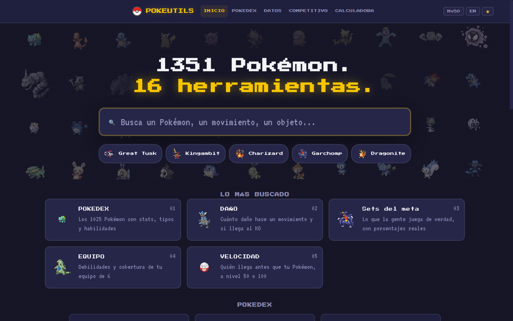
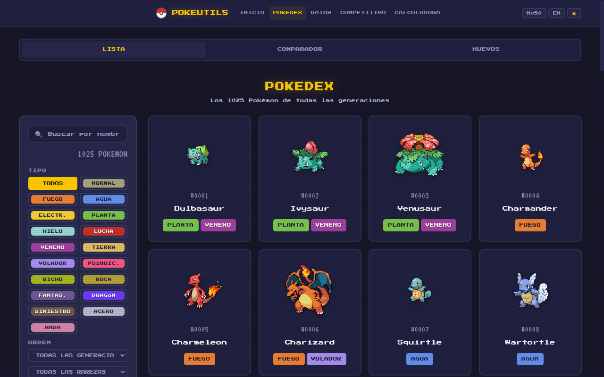
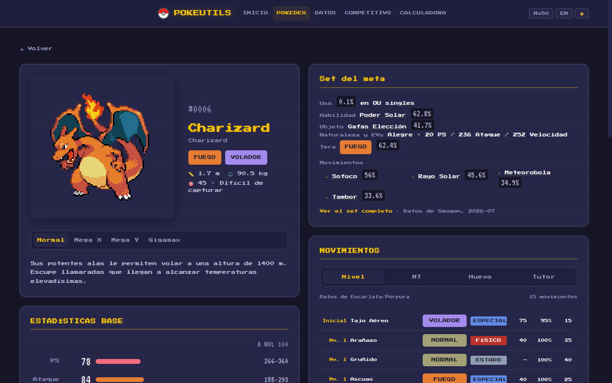
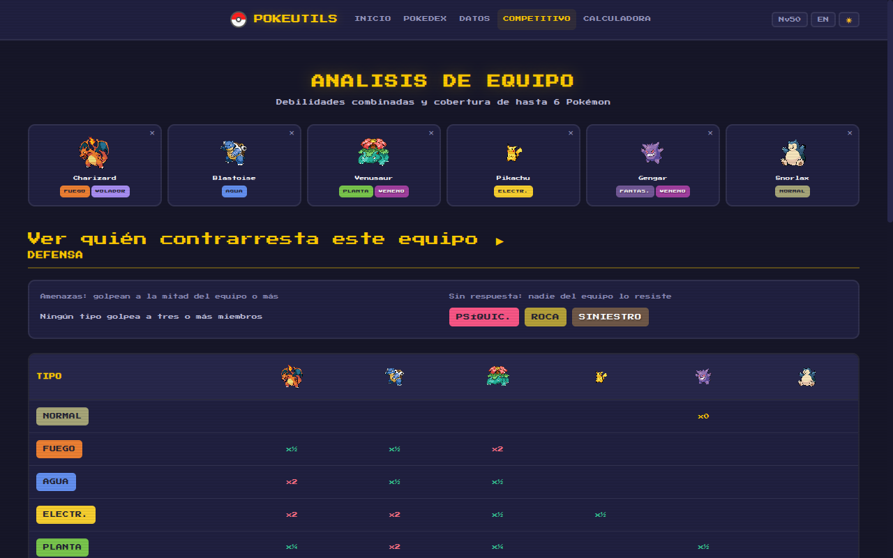
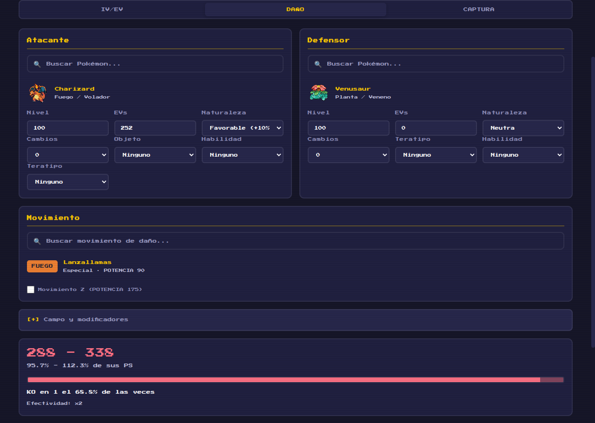
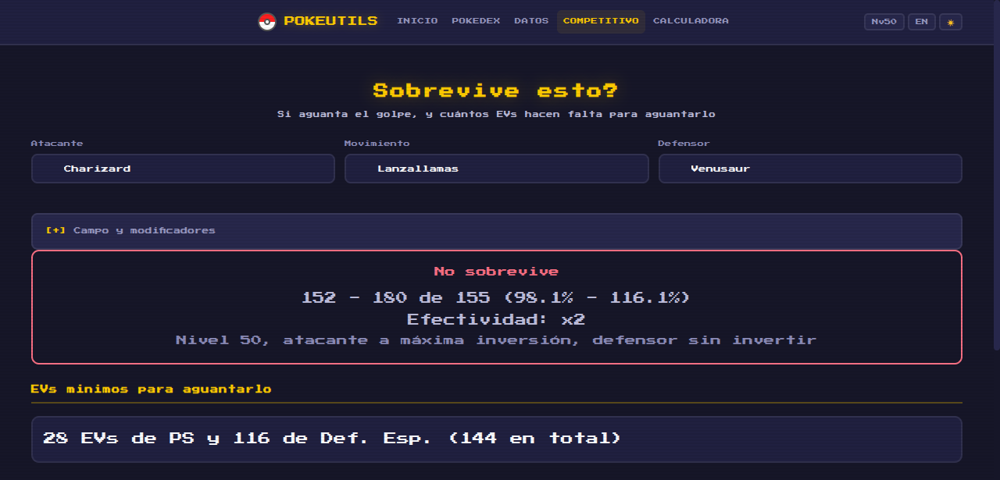

***Español** · [English](README.en.md)*

# PokeUtils

**Tu guía Pokémon retro.** Si juegas competitivo, aquí sabes si tu equipo aguanta
ese ataque y quién te lo puede reventar. Si crías, con quién cruza cada uno. Y si
solo vienes a consultar la dex, está entera, en español, y no te pide una cuenta.

[](https://pokeutils.alvarotc.com)




## Qué puedes hacer

- **Preparar un equipo y saber por dónde te van a entrar.** Metes hasta seis,
  y te dice qué tipos amenazan a media plantilla, cuáles no resiste nadie, qué
  cobertura te falta y quién de toda la dex te contrarresta.
- **Criar sin adivinar.** Los 15 grupos huevo, quién cruza con quién y cuántas
  parejas tiene cada Pokémon, aplicando las cinco reglas de cría de verdad.
- **Consultar la dex sin fricción.** 1025 especies y 326 formas con sus stats,
  tipos, habilidades, evoluciones y todos los movimientos que aprenden. Gratis,
  sin cuenta y sin anuncios.

En la portada hay un buscador que cruza los cuatro conjuntos a la vez —1351
Pokémon, 937 movimientos, 313 habilidades y 1849 objetos— y te lleva directo a
la página que tiene la respuesta.

## Las 16 herramientas

### Pokédex

- **[Pokédex](https://pokeutils.alvarotc.com/#/pokedex)** — Los 1025 Pokémon
  (1.ª a 9.ª generación) con sprite, stats, tipos, habilidades y sus debilidades.
  Filtra por generación y rareza, ordena por cualquier estadística base, y
  comparte la vista: cada filtro va en la URL.
  - **Ficha de un Pokémon** — Ratio de captura, el mínimo y el máximo que puede
    alcanzar cada stat a nivel 100, la descripción de sus habilidades, la línea
    evolutiva entera con la condición exacta de cada paso, y todos los
    movimientos que aprende por nivel, MT, cría o tutor.
  - **Formas alternativas** — 326: 97 megas, 34 Gigamax, 60 regionales y el
    resto. Salen como pestañas dentro de la página de su especie, así que
    `#/pokedex/6` sigue siendo Charizard mires la forma que mires.
- **[Comparador](https://pokeutils.alvarotc.com/#/compare)** — Hasta cuatro lado
  a lado por estadísticas base, con las debilidades x4 y x2 de cada uno en filas
  aparte.
- **[Grupos huevo](https://pokeutils.alvarotc.com/#/egg)** — Los 15 grupos, quién
  cría con quién y cuántas parejas tiene cada Pokémon. Aplica las cinco reglas,
  no solo la del grupo compartido: los del grupo Desconocido no crían nunca,
  Ditto cría con todos menos con ellos, Ditto no cría con Ditto, los sin género
  solo crían con Ditto, y dos del mismo género único tampoco crían entre sí.

### Datos

- **[Movimientos](https://pokeutils.alvarotc.com/#/moves)** — Los 937 con tipo,
  categoría, potencia, precisión y descripción. Filtra por prioridad o por la
  stat que sube o baja, y comparte la vista: cada filtro va en la URL.
  - **Ficha de un movimiento** — La prioridad en palabras (ataca primero / ataca
    último), los cambios de stats como dato y no enterrados en la descripción,
    y **qué Pokémon lo aprenden**, separados por nivel, MT, cría y tutor. Ahí
    está también lo que enseña cada MT.
- **[Habilidades](https://pokeutils.alvarotc.com/#/abilities)** — Las 313 con su
  descripción y buscador.
- **[Objetos](https://pokeutils.alvarotc.com/#/items)** — 1849 objetos con su
  sprite, filtros por categoría y ficha al abrirlos.
- **[Naturalezas](https://pokeutils.alvarotc.com/#/natures)** — Las 25 con sus
  modificadores y una rejilla 5x5 para verlas de un vistazo.
- **[Tabla de tipos](https://pokeutils.alvarotc.com/#/types)** — Efectividad para
  uno o dos tipos, al ataque y a la defensa.

### Competitivo

- **[Análisis de equipo](https://pokeutils.alvarotc.com/#/team)** — Hasta 6
  Pokémon: qué tipos amenazan a la mitad del equipo, cuáles no resiste nadie y
  la cobertura que te falta. El equipo va en la URL, así que un equipo es un
  enlace.
- **[Contrarrestar mi equipo](https://pokeutils.alvarotc.com/#/counter)** —
  Recorre los 1259 candidatos —las especies y sus formas de combate— y te
  devuelve quién amenaza a la mitad de tu equipo o más, ordenados por poder
  ofensivo y marcando quién además llega antes. Las amenazas medidas en el meta
  van señaladas aparte de las que solo se deducen del tipo.
- **[Velocidad](https://pokeutils.alvarotc.com/#/speed)** — Relativa a un Pokémon
  que eliges, no una tabla global: los 15 de arriba y los 15 de abajo, con los
  empates señalados, porque empatar no es llegar antes.
- **[¿Sobrevive esto?](https://pokeutils.alvarotc.com/#/survive)** — Atacante,
  movimiento y defensor; el rango de daño, el veredicto, y **el reparto de EVs
  más barato que aguanta el golpe**, encontrado a fuerza bruta sobre la fórmula
  de daño real.
- **[Sets del meta](https://pokeutils.alvarotc.com/#/meta)** — Lo que la gente
  juega de verdad: naturaleza y EVs, objeto, habilidad, Teratipo y movimientos,
  cada uno con su porcentaje de uso real. OU singles y VGC dobles.

### Calculadoras

- **[IV/EV](https://pokeutils.alvarotc.com/#/calculator)** — Dos modos: sacar las
  stats finales a partir de IVs y EVs, o deducir los IVs posibles a partir de una
  stat que ya conoces.
- **[Daño](https://pokeutils.alvarotc.com/#/calculator?tab=damage)** — La fórmula
  de 5.ª generación en adelante, con clima, campo, pantallas, habilidades,
  objetos y críticos. El panel entero va en la URL, así que un cálculo es un
  enlace.
- **[Captura](https://pokeutils.alvarotc.com/#/calculator?tab=catch)** — La
  probabilidad por ball, estado y PS restantes, incluidas las balls cuyo
  multiplicador depende de la situación.

## Lo que comparten todas

- **Todo es un enlace.** Los filtros de una lista, los seis miembros de un
  equipo, el panel entero de un cálculo: el estado vive en la dirección, así que
  compartirlo es copiar la barra del navegador.
- **Español e inglés**, y no solo la interfaz: los nombres de Pokémon,
  movimientos, habilidades y objetos también.
- **Nivel 50 o 100, global.** Un interruptor arriba a la derecha: 50 para VGC
  dobles, 100 para Smogon singles. Todo lo competitivo lo respeta.
- **Dos temas, claro y oscuro**, y todo el texto se lee en los dos: cada color
  pasa el contraste AA, comprobado uno a uno.
- **En el móvil también**, con menú y rejillas que se adaptan.
- **Sin cuentas, sin anuncios y gratis.**

## Cómo se ve

La Pokédex, con sus filtros y su orden:



La ficha de un Pokémon: formas, set del meta y todo lo que aprende:



El análisis de un equipo de seis, con su matriz defensiva:



Y las dos preguntas que más se hacen: cuánto daño hace y si lo aguanta.





## De dónde salen los datos

- **[PokeAPI](https://pokeapi.co)** para todos los datos de juego: especies,
  formas, movimientos, habilidades, objetos, evoluciones y aprendizajes.
- **[Smogon](https://www.smogon.com/stats/)** para los sets del meta, sacados de
  las estadísticas de uso mensuales publicadas en `stats/<mes>/chaos/`.

Sobre los datos de Smogon en concreto, porque redistribuir no es lo mismo que
consultar y esto se sirve como ficheros estáticos en un dominio propio:

- **Solo se usan las estadísticas de uso agregadas**, que son de dominio público
  — los porcentajes de `chaos/`. Los sets que se muestran aquí están derivados de
  esos porcentajes.
- **Los análisis escritos y los sets curados de Smogon tienen copyright** de
  Smogon y de quienes colaboran con ellos. **No se usa ninguno.** Ni un análisis,
  ni un texto, ni un set escrito a mano.
- La atribución se muestra en la propia aplicación, junto a los datos, con el mes
  del que vienen.

Los textos en español que PokeAPI no trae están recopilados del texto oficial de
los juegos vía WikiDex, Bulbapedia y pkproject.net, con la fuente documentada
entrada a entrada en el código. Unas pocas descripciones están redactadas por
PokeUtils y van marcadas como tales.

## Legal

PokeUtils is an unofficial, free fan-made app and is NOT affiliated, endorsed or supported by Nintendo, GAME FREAK or The Pokemon Company in any way.

Pokemon and all respective names are trademarks of Nintendo. No copyright infringement intended.

Pokemon (c) 2002-2026 Pokemon. (c) 1995-2026 Nintendo/Creatures Inc./GAME FREAK inc.

## Autor

Hecha con una Pokéball por [Alvaro Torres](https://github.com/alvarotorresc)

## Desarrollo

Sin dependencias, sin framework: son ficheros estáticos.

```bash
node scripts/serve.mjs        # puerto 8090, o el que le pases
```

Usa ese y no `python3 -m http.server`: ese último no manda `Cache-Control`, el
navegador se guarda los módulos por su cuenta y sigues viendo el código anterior
después de editar, sin que nada te avise. `scripts/serve.mjs` manda `no-store`.

`data/` está generado, no se edita a mano: lo reconstruyen los scripts de
`scripts/`, y los `check-*.mjs` verifican que lo reconstruido sigue cuadrando.
